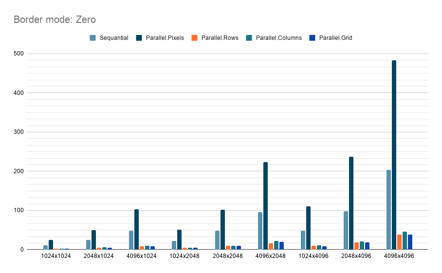
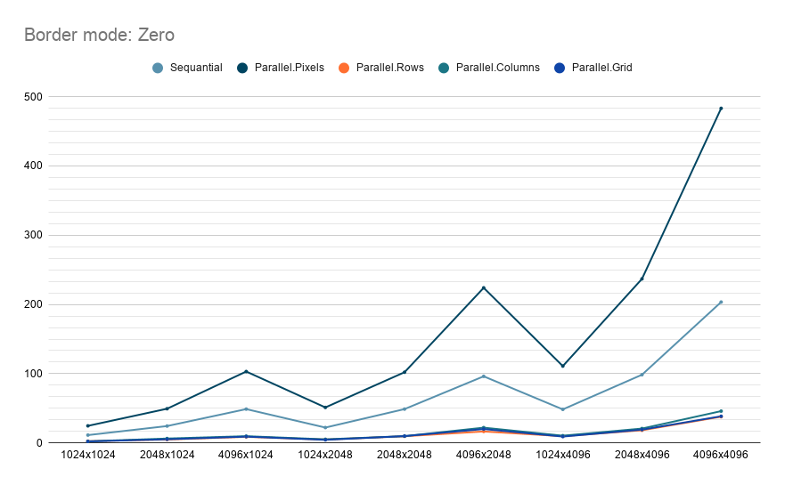
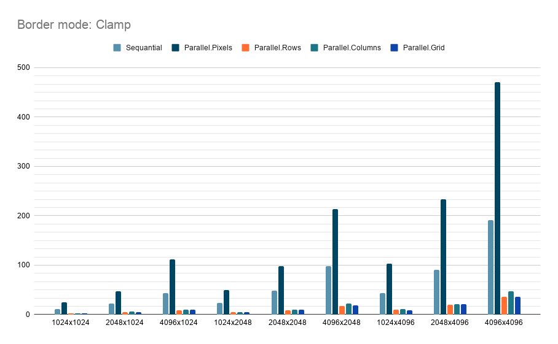
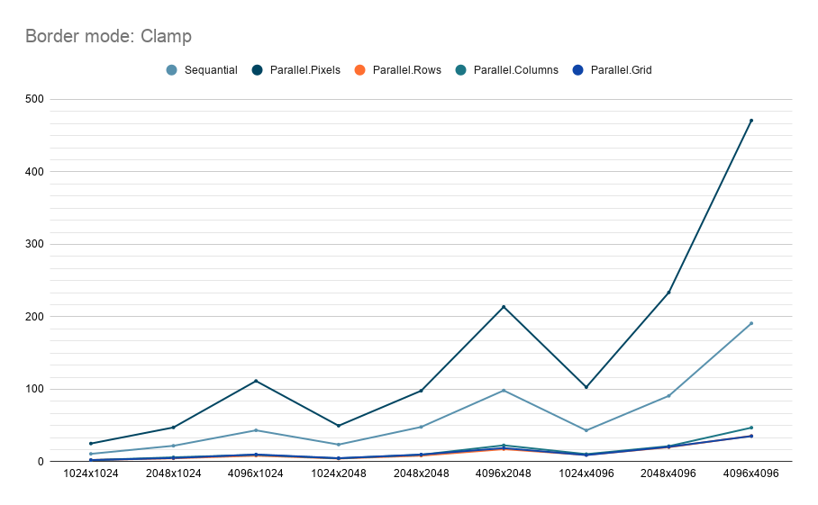

# Анализ производительнсти
- **Зависимость от ширины и высоты**: При фиксированной высоте увеличение ширины приводит к росту времени в 4-5 раз, тогда как при фиксированной ширине увеличение высоты дает рост в 2-3 раза. Такая разнца связана с особенностями кэширования памяти и последовательным доступом к данным в массивах.
- **Зависимость от способа параллелизма**: 
  - **Sequential**: Базовый последовательный метод, без параллелизма. Примерно в 5 раз медленнее самого эффективного параллельного метода
  - **Parallel.Pixels**: Параллелизм по каждому пикселю создает огромное количество задач, что приводит к высоким накладным расходам на синхронизацию. Самый медленный метод с высокой дисперсией.
  - **Parallel.Rows**: Параллелизм по строкам эффективен для изображений с большим количеством строк. Разделяет изображение на горизонтальные полосы, минимизируя конфликты памяти. Часто быстрее Parallel.Columns.
  - **Parallel.Columns**: Параллелизм по столбцам показывает себя лучше на изображениях с большим количеством столбцов. Однако он может страдать от неравномерности нагрузки при широких изображениях.
  - **Parallel.Grid**: Наиболее эффективный метод, разделяющий изображение на прямоугольные блоки (сетку). Балансирует нагрузку между потоками, минимизирует накладные расходы и обеспечивает лучшую масштабируемость. Часто в 2-3 раза быстрее Sequential и в 10+ раз быстрее Parallel.Pixels.

## Border mode: Zero
### Диаграмма

### График

### Таблица
| Method           | Width | Height | Mean       |
|----------------- |------ |------- |-----------:|
| Sequential       | 1024  | 1024   |  11.347 ms |
| Parallel.Pixels  | 1024  | 1024   |  24.677 ms |
| Parallel.Rows    | 1024  | 1024   |   2.510 ms |
| Parallel.Columns | 1024  | 1024   |   2.313 ms |
| Parallel.Grid    | 1024  | 1024   |   2.247 ms |
|                  |       |        |            |
| Sequential       | 1024  | 2048   |  22.219 ms |
| Parallel.Pixels  | 1024  | 2048   |  51.281 ms |
| Parallel.Rows    | 1024  | 2048   |   4.961 ms |
| Parallel.Columns | 1024  | 2048   |   5.252 ms |
| Parallel.Grid    | 1024  | 2048   |   4.517 ms |
|                  |       |        |            |
| Sequential       | 1024  | 4096   |  48.451 ms |
| Parallel.Pixels  | 1024  | 4096   | 110.977 ms |
| Parallel.Rows    | 1024  | 4096   |   9.724 ms |
| Parallel.Columns | 1024  | 4096   |  10.589 ms |
| Parallel.Grid    | 1024  | 4096   |   8.937 ms |
|                  |       |        |            |
| Sequential       | 2048  | 1024   |  24.379 ms |
| Parallel.Pixels  | 2048  | 1024   |  49.390 ms |
| Parallel.Rows    | 2048  | 1024   |   4.982 ms |
| Parallel.Columns | 2048  | 1024   |   6.388 ms |
| Parallel.Grid    | 2048  | 1024   |   5.264 ms |
|                  |       |        |            |
| Sequential       | 2048  | 2048   |  48.880 ms |
| Parallel.Pixels  | 2048  | 2048   | 102.091 ms |
| Parallel.Rows    | 2048  | 2048   |   9.650 ms |
| Parallel.Columns | 2048  | 2048   |   9.829 ms |
| Parallel.Grid    | 2048  | 2048   |   9.884 ms |
|                  |       |        |            |
| Sequential       | 2048  | 4096   |  98.503 ms |
| Parallel.Pixels  | 2048  | 4096   | 236.901 ms |
| Parallel.Rows    | 2048  | 4096   |  18.314 ms |
| Parallel.Columns | 2048  | 4096   |  20.790 ms |
| Parallel.Grid    | 2048  | 4096   |  19.169 ms |
|                  |       |        |            |
| Sequential       | 4096  | 1024   |  48.863 ms |
| Parallel.Pixels  | 4096  | 1024   | 103.113 ms |
| Parallel.Rows    | 4096  | 1024   |   8.819 ms |
| Parallel.Columns | 4096  | 1024   |   9.795 ms |
| Parallel.Grid    | 4096  | 1024   |   9.115 ms |
|                  |       |        |            |
| Sequential       | 4096  | 2048   |  96.191 ms |
| Parallel.Pixels  | 4096  | 2048   | 223.957 ms |
| Parallel.Rows    | 4096  | 2048   |  16.587 ms |
| Parallel.Columns | 4096  | 2048   |  22.102 ms |
| Parallel.Grid    | 4096  | 2048   |  20.067 ms |
|                  |       |        |            |
| Sequential       | 4096  | 4096   | 203.417 ms |
| Parallel.Pixels  | 4096  | 4096   | 483.104 ms |
| Parallel.Rows    | 4096  | 4096   |  37.907 ms |
| Parallel.Columns | 4096  | 4096   |  45.954 ms |
| Parallel.Grid    | 4096  | 4096   |  38.499 ms | 

## Border mode: Clamp

### Анализ производительности
- **Зависимость от border mode**: В режиме Clamp граничные пиксели повторяют значения ближайших пикселей, что может давать более естественные результаты по краям, но иногда медленнее из-за дополнительных вычислений по сравнению с Zero, где нули упрощают обработку.
- **Зависимость от ширины и высоты**: Аналогично Zero, производительность падает с ростом размеров, с заметным ростом времени для больших изображений. При фиксированной высоте увеличение ширины приводит к большему росту времени по сравнению с увеличением высоты при фиксированной ширине, что связано с особенностями доступа к памяти и параллелизма. Например, переход от 1024x1024 к 4096x1024 увеличивает время Sequential с 10.9 ms до 43.4 ms (рост ~4x), а к 1024x4096 - до 43.2 ms (рост ~4x), но с разными паттернами для параллельных методов.
- **Зависимость от способа параллелизма**: 
  - **Sequential**: Стабильный базовый метод, но медленный на больших размерах (190.9 ms для 4096x4096).
  - **Parallel.Pixels**: Высокие накладные расходы из-за большого числа мелких задач, дисперсия выше, чем в Zero (470.9 ms для 4096x4096).
  - **Parallel.Rows**: Эффективен для строко-ориентированных изображений, часто превосходит Columns (например, для 1024x4096: 9.4 ms vs 10.5 ms).
  - **Parallel.Columns**: Подходит для столбцов, но уступает Rows в большинстве тестов (для 4096x1024: 9.6 ms vs 8.4 ms).
  - **Parallel.Grid**: Оптимальный баланс, минимизирует накладные расходы и обеспечивает лучшую производительность (35.4 ms для 4096x4096), в 5-6 раз быстрее Sequential.

### Диаграмма

### График

### Таблица

| Method           | Width | Height | Mean       |
|----------------- |------ |------- |-----------:|
| Sequential       | 1024  | 1024   |  10.899 ms |
| Parallel.Pixels  | 1024  | 1024   |  25.133 ms |
| Parallel.Rows    | 1024  | 1024   |   2.423 ms |
| Parallel.Columns | 1024  | 1024   |   2.210 ms |
| Parallel.Grid    | 1024  | 1024   |   2.339 ms |
|                  |       |        |            |
| Sequential       | 1024  | 2048   |  23.711 ms |
| Parallel.Pixels  | 1024  | 2048   |  49.684 ms |
| Parallel.Rows    | 1024  | 2048   |   4.385 ms |
| Parallel.Columns | 1024  | 2048   |   4.687 ms |
| Parallel.Grid    | 1024  | 2048   |   4.933 ms |
|                  |       |        |            |
| Sequential       | 1024  | 4096   |  43.248 ms |
| Parallel.Pixels  | 1024  | 4096   | 102.942 ms |
| Parallel.Rows    | 1024  | 4096   |   9.432 ms |
| Parallel.Columns | 1024  | 4096   |  10.499 ms |
| Parallel.Grid    | 1024  | 4096   |   9.198 ms |
|                  |       |        |            |
| Sequential       | 2048  | 1024   |  22.027 ms |
| Parallel.Pixels  | 2048  | 1024   |  47.339 ms |
| Parallel.Rows    | 2048  | 1024   |   4.699 ms |
| Parallel.Columns | 2048  | 1024   |   6.117 ms |
| Parallel.Grid    | 2048  | 1024   |   5.095 ms |
|                  |       |        |            |
| Sequential       | 2048  | 2048   |  47.986 ms |
| Parallel.Pixels  | 2048  | 2048   |  97.947 ms |
| Parallel.Rows    | 2048  | 2048   |   8.399 ms |
| Parallel.Columns | 2048  | 2048   |   9.672 ms |
| Parallel.Grid    | 2048  | 2048   |   9.903 ms |
|                  |       |        |            |
| Sequential       | 2048  | 4096   |  90.954 ms |
| Parallel.Pixels  | 2048  | 4096   | 233.673 ms |
| Parallel.Rows    | 2048  | 4096   |  20.059 ms |
| Parallel.Columns | 2048  | 4096   |  21.500 ms |
| Parallel.Grid    | 2048  | 4096   |  20.564 ms |
|                  |       |        |            |
| Sequential       | 4096  | 1024   |  43.379 ms |
| Parallel.Pixels  | 4096  | 1024   | 111.441 ms |
| Parallel.Rows    | 4096  | 1024   |   8.383 ms |
| Parallel.Columns | 4096  | 1024   |   9.556 ms |
| Parallel.Grid    | 4096  | 1024   |  10.015 ms |
|                  |       |        |            |
| Sequential       | 4096  | 2048   |  98.364 ms |
| Parallel.Pixels  | 4096  | 2048   | 213.736 ms |
| Parallel.Rows    | 4096  | 2048   |  17.360 ms |
| Parallel.Columns | 4096  | 2048   |  22.656 ms |
| Parallel.Grid    | 4096  | 2048   |  18.816 ms |
|                  |       |        |            |
| Sequential       | 4096  | 4096   | 190.988 ms |
| Parallel.Pixels  | 4096  | 4096   | 470.957 ms |
| Parallel.Rows    | 4096  | 4096   |  35.611 ms |
| Parallel.Columns | 4096  | 4096   |  47.020 ms |
| Parallel.Grid    | 4096  | 4096   |  35.363 ms | 
